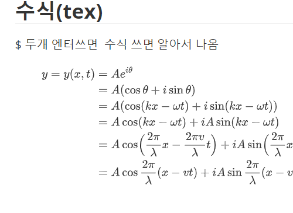

# :computer: markdown 작성법

## 제목heading 

제목은 문서의 구조와 관련이 있음 h1~h6까지 존재 하며 # 을 붙여서 표현 가능 

## 목록(listing) :book:

### 순서 있는목록 

문장 맨처음에 1. 띄어쓰기 작성시 자동으로 목록바뀜  탭을누르면 1-1가된 들여쓰기  앞으로갈때 쉬프트탭 

1. 수업을한다 
   1. 슬라이드진행 
   2. 자습
2. 쉬는시간갖기
3.  

### 순서없는 목록

문장맨 처음에 -를 쓰고 띄어쓰기 하면 자동으로 바뀜

- 오늘할일 git배우기
  - 리포초기화하기
  - 스테이징하기
- cmd명령어 배우기
- markdown문법배우기

## 본문 꾸미기 (inline deco )

나는 오늘 *github*특강 *로 단어를 감쌈 이탤릭처리

git은**vs**다  **로 감싼다 볼드처리 

폴더이동은 `cd`명령어를 사용한다  `로 단어를 감쌈 코드스플릭

폴더를 생성할때는 mkdir을 사용한다 .

인용구 >  를 쓰면 된다  엔터 두번치면 나와짐 

> 오늘도 공부를 한다 

## 코드 블럭  (code block)

back quote  ` 3개 누르고 엔터로 생성

```python
a=1
a=2
c= a+b
print (c)
```


##  표 (table)

pipe ( | ) 로 열을 구분하고 엔터로 표 생성 

띄어쓰기 없이 | 명령어 | 설명 |

컨트롤 엔터 표 추가   그냥 엔터쓰면 표 나옴

표 위에 오른쪽 .. 누르면 행삭제추가등 볼수있다 


| 명령어  | 설명      | 사용예시      |
| ------- | --------- | ------------- |
| `mrdir` | v폴더생성 | `mkdir ....   |
| `cd `   | 폴더이동  | `cd` ....     |
| `touch` | 폴더생성  | touch. aa.txt |


## 수식(tex)

$ 두개 엔터쓰면  수식 쓰면 알아서 나옴  
$$
\begin{align*}
y = y(x,t) &= A e^{i\theta} \\
&= A (\cos \theta + i \sin \theta) \\
&= A (\cos(kx - \omega t) + i \sin(kx - \omega t)) \\
&= A\cos(kx - \omega t) + i A\sin(kx - \omega t)  \\
&= A\cos \Big(\frac{2\pi}{\lambda}x - \frac{2\pi v}{\lambda} t \Big) + i A\sin \Big(\frac{2\pi}{\lambda}x - \frac{2\pi v}{\lambda} t \Big)  \\
&= A\cos \frac{2\pi}{\lambda} (x - v t) + i A\sin \frac{2\pi}{\lambda} (x - v t)
\end{align*}
$$


화면캡쳐 윈도우 +쉬프트 + s 누른후   컨트롤v 하면 된다 

켭쳐한폴더는 지금있는곳에 저장되있다 

### 이미지 :icecream:

: 하고 검색하면 이미지 삽입가능 

